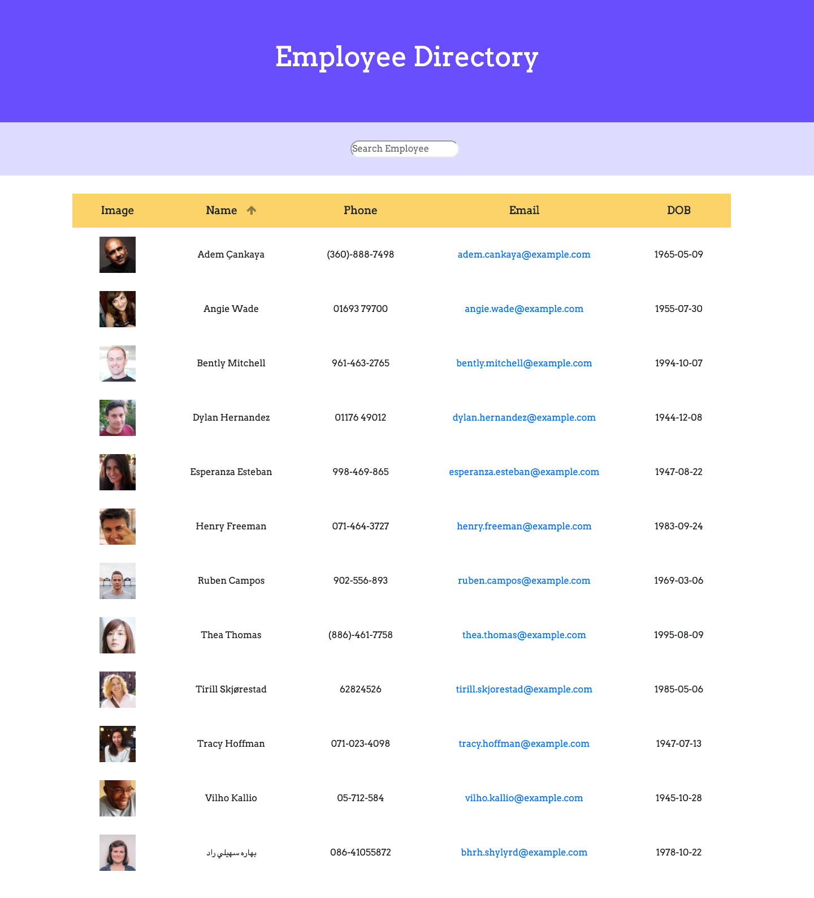

# Employee Directory
This application allow users to search the employees' name and also sort the employees' name in alphabetical order.

Deployed Link: https://sherryj-sk.github.io/Employee-Directory/

## Description
This single page app was building by using React. The App.js contain the functions that need to render on the html: 
- **Search function:** 
When user type the name in the search box, the list will show the name contains the letters have been entered simultaneously. This is by using the setState() to filter the name in the employee.json and map them to the related divs.
- **Sort function:** 
When user click the "Name" in the table head, the table will be sorted in alphabetical order. This is also completed by using setState(), which will trigger the function to sort.

To make sure the data and function can be rendered to the correct div, there are five components:
- **Container:** Return a div which will contain other components.
- **Header:** Contain the header div.
- **Search:** Take the user entered name as value by using props.
- **ListHeader:** Take the action from the html and render the sort function.
- **EmployeeList:** Display the data from employee.json in a table.

## Acknowledgments:
- React
  - setState
  - Component
  - Props
- ReactDOM

